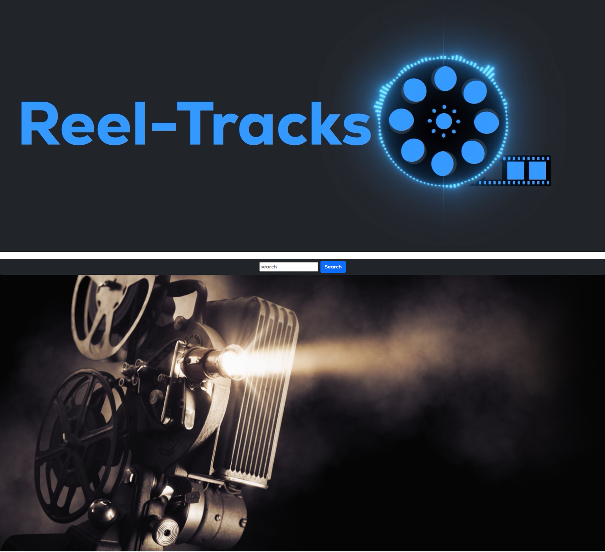

# Reel-Tracks

Search any movie and the results will show you the corresponding soundtrack.

## Description

The goal of this project was to develop an app that allowed users to search for albums from their favorite movie.

## APIs 
* OMDb API utilized to get movie details. https://www.omdbapi.com/
* Deezer API utilized to get music details. https://developers.deezer.com/

## Usage

In our application the user will have the ability to type in a movie and then retrieve movie information along with the corresponding album. Some searches
may not yield the correct results due to the variation of movie titles. 

The following image shows the web application's appearance and functionality:

    

    

## Application

Please click on the [link] https://ricky-sama.github.io/Reel-Tracks/ to visit the Reel-Tracks application. 

## Credits

  * [Kevin Rice] | Github : [DirtyRice901]
  * [Ricardo Scuotto] | Github : [Ricky-Sama]
  * [Gavin McNeil] | Github : [gavincmcneil]
  * [Jesse Lare] | Github : [SideControlJS]
  * [Shamar Melvin] | Github : [DonCod3]